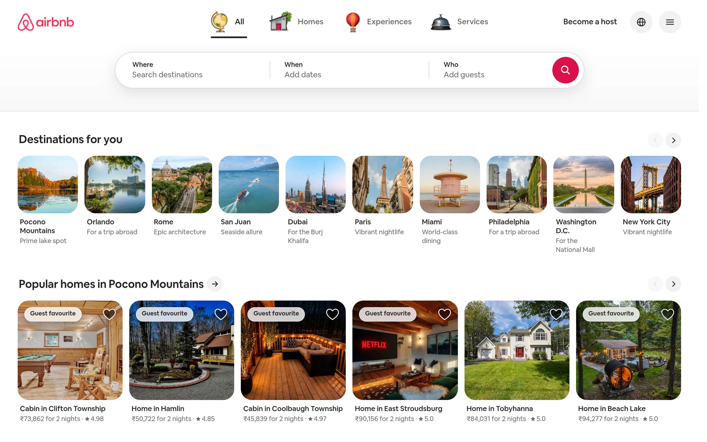

# airbnb Design System

You are building UI for **airbnb**. Light-themed, warm palette, sans-serif typography (kakaopay System Sans), compact density on a 4px grid, expressive motion.

## Visual Reference

**IMPORTANT**: Study ALL screenshots below before writing any UI. Match colors, typography, spacing, layout, and motion exactly as shown.

### Homepage



> Read `references/DESIGN.md` for full token details.

## Design Philosophy

- **Layered depth** — use shadow tokens to create a sense of physical layering. Each elevation level has a specific shadow.
- **Gradient accents** — gradients are used thoughtfully for emphasis, not decoration.
- **Type pairing** — kakaopay System Sans for body/UI text, Roboto for headings/display. Never introduce a third typeface.
- **compact density** — 4px base grid. Every dimension is a multiple of 4.
- **warm palette** — the color temperature runs warm, matching the sans-serif typography.
- **Restrained accent** — `#ff385c` is the only pop of color. Used exclusively for CTAs, links, focus rings, and active states.
- **Expressive motion** — animations are an integral part of the experience. Use spring physics and layout animations.

## Color System

### Core Palette

| Role | Token | Hex | Use |
|------|-------|-----|-----|
| Background | `--background` | `#ffffff` | Page/app background |
| Surface | `--surface` | `#f2f2f2` | Cards, panels, modals |
| Text Primary | `--text-primary` | `#222222` | Headings, body text |
| Text Muted | `--text-muted` | `#4a4a4a` | Captions, placeholders |
| Accent | `--accent` | `#ff385c` | CTAs, links, focus rings |
| Border | `--border` | `#3f3f3f` | Dividers, card borders |

### Status Colors

| Status | Hex | Use |
|--------|-----|-----|
| Success | `#038026` | Confirmations, positive trends |
| Danger | `#a3150f` | Errors, destructive actions |

### Extended Palette

- **elevation-sharp-edge-background:** `#000000` — Deep background layer or shadow color
- **palette-bg-beige-secondary-hover:** `#c1c1c1` — Secondary text, placeholder text
- **palette-bg-primary-inverse-disabled:** `#dddddd`
- **dls-button_color_disabled:** `#878787`
- **palette-bg-primary-inverse-invalid:** `#d7251c` — Warm accent — hover glow or decorative highlight
- **palette-bg-primary-inverse-error:** `#c13515` — Destructive actions, error states
- **palette-bg-primary:** `#111111` — Deep background layer or shadow color
- **palette-text-brand-selected:** `#da1249` — Core brand color

### CSS Variable Tokens

```css
--amplify-colors-brand-primary-10: var(--palette-rausch100);
--amplify-colors-brand-primary-20: var(--palette-rausch200);
--amplify-colors-brand-primary-40: var(--palette-rausch400);
--amplify-colors-brand-primary-60: var(--palette-rausch600);
--amplify-colors-brand-primary-80: var(--palette-rausch700);
--amplify-colors-brand-primary-90: var(--palette-rausch800);
--amplify-colors-brand-primary-100: var(--palette-rausch900);
--amplify-colors-primary-10: var(--palette-rausch100);
--amplify-colors-primary-20: var(--palette-rausch200);
--amplify-colors-primary-40: var(--palette-rausch400);
--amplify-colors-primary-60: var(--palette-rausch600);
--amplify-colors-primary-80: var(--palette-rausch600);
--amplify-colors-primary-90: var(--palette-rausch800);
--amplify-colors-primary-100: var(--palette-rausch900);
--amplify-colors-background-primary: var(--palette-bg-primary);
--amplify-colors-background-secondary: var(--palette-bg-secondary);
--amplify-colors-font-primary: var(--palette-text-primary);
--amplify-colors-font-secondary: var(--palette-text-secondary);
--amplify-colors-border-primary: var(--palette-border-primary);
--amplify-colors-border-tertiary: var(--palette-border-tertiary);
```

## Typography

### Font Stack

- **kakaopay System Sans** — Heading 1, Heading 2, Heading 3
- **Roboto** — Body, Caption
- **SFMono-Regular** — Code

### Font Sources

```css
@font-face {
  font-family: "Airbnb Cereal VF";
  src: url("fonts/AirbnbCerealVF-Regular.woff2") format("woff2");
  font-weight: 400;
}
@font-face {
  font-family: "Roboto";
  src: url("fonts/Roboto-Bold.ttf") format("truetype");
  font-weight: 700;
}
@font-face {
  font-family: "Roboto";
  src: url("fonts/Roboto-Regular.ttf") format("truetype");
  font-weight: 400;
}
```

### Type Scale

| Role | Family | Size | Weight |
|------|--------|------|--------|
| Heading 1 | kakaopay System Sans | 9.0625rem | 700 |
| Heading 2 | kakaopay System Sans | 7.5rem | 700 |
| Heading 3 | kakaopay System Sans | 6.25rem | 700 |
| Body | Roboto | 0.875rem | 400 |
| Caption | Roboto | 0.8125rem | 400 |
| Code | SFMono-Regular | 14px | 400 |

### Typography Rules

- Body/UI: **kakaopay System Sans**, Headings: **Roboto** — these are the only display fonts
- Max 3-4 font sizes per screen
- Headings: weight 600-700, body: weight 400
- Use color and opacity for text hierarchy, not additional font sizes
- Line height: 1.5 for body, 1.2 for headings

## Spacing & Layout

### Base Grid: 4px

Every dimension (margin, padding, gap, width, height) must be a multiple of **4px**.

### Spacing Scale

`2, 4, 6, 8, 10, 12, 14, 16, 18, 20, 22, 24` px

### Spacing as Meaning

| Spacing | Use |
|---------|-----|
| 4-8px | Tight: related items (icon + label, avatar + name) |
| 12-16px | Medium: between groups within a section |
| 24-32px | Wide: between distinct sections |
| 48px+ | Vast: major page section breaks |

### Border Radius

Scale: `0.25rem, 0.5rem, 1px, 1ch, 1rem, 1.5px, 1.875rem, 2px, 3px, 3.2px, 4px, 5.25px, 5.5px, 6px, 8px, 9px, 10px, 11px, 12px, 14px, 14%, 15px, 16px, 17px, 18px, 20px, 22px, 24px, 26px, 27px, 28px, 28%, 29px, 30px, 32px, 36px, 40px, 42px, 42.654px, 44px, 45px, 48px, 50px, 54px, 56px, 80px, 99em, 100px, 100%, 128px, 500px, 999px, inherit, 133px, 1000px, calc(infinity*1px), unset`
Default: `26px`

### Container

Max-width: `1127px`, centered with auto margins.

### Breakpoints

| Name | Value |
|------|-------|
| xs | 23em |
| xs | 270px |
| xs | 300px |
| xs | 320px |
| xs | 325px |
| xs | 330px |
| xs | 357px |
| xs | 366px |
| xs | 370px |
| xs | 375px |
| xs | 376px |
| xs | 395px |
| xs | 401px |
| xs | 420px |
| xs | 429px |
| xs | 431px |
| xs | 440px |
| sm | 499px |
| sm | 500px |
| sm | 535px |
| sm | 541px |
| sm | 550px |
| sm | 551px |
| sm | 599px |
| sm | 600px |
| sm | 633px |
| sm | 634px |
| sm | 639px |
| sm | 640px |
| md | 667px |
| md | 679px |
| md | 680px |
| md | 693px |
| md | 694px |
| md | 699px |
| md | 700px |
| md | 743px |
| md | 743.99px |
| md | 744px |
| md | 759px |
| md | 760px |
| md | 768px |
| lg | 777px |
| lg | 778px |
| lg | 800px |
| lg | 813px |
| lg | 814px |
| lg | 819px |
| lg | 820px |
| lg | 871px |
| lg | 872px |
| lg | 879px |
| lg | 880px |
| lg | 894px |
| lg | 909px |
| lg | 910px |
| lg | 939px |
| lg | 940px |
| lg | 949px |
| lg | 950px |
| lg | 959px |
| lg | 960px |
| lg | 969px |
| lg | 970px |
| lg | 983px |
| lg | 984px |
| lg | 1024px |
| xl | 1039px |
| xl | 1040px |
| xl | 1049px |
| xl | 1050px |
| xl | 1059px |
| xl | 1060px |
| xl | 1075px |
| xl | 1119px |
| xl | 1120px |
| xl | 1127px |
| xl | 1127.99px |
| xl | 1128px |
| xl | 1140px |
| xl | 1141px |
| xl | 1159px |
| xl | 1160px |
| xl | 1189px |
| xl | 1190px |
| xl | 1194px |
| xl | 1199px |
| xl | 1200px |
| xl | 1227px |
| xl | 1228px |
| xl | 1238px |
| xl | 1239px |
| xl | 1240px |
| xl | 1280px |
| 2xl | 1284px |
| 2xl | 1285px |
| 2xl | 1348px |
| 2xl | 1359px |
| 2xl | 1360px |
| 2xl | 1395px |
| 2xl | 1396px |
| 2xl | 1405px |
| 2xl | 1406px |
| 2xl | 1439px |
| 2xl | 1440px |
| 2xl | 1459px |
| 2xl | 1460px |
| 2xl | 1467px |
| 2xl | 1468px |
| 2xl | 1509px |
| 2xl | 1510px |
| 2xl | 1559px |
| 2xl | 1560px |
| 2xl | 1583px |
| 2xl | 1584px |
| 2xl | 1599px |
| 2xl | 1600px |
| 2xl | 1659px |
| 2xl | 1660px |
| 2xl | 1719px |
| 2xl | 1720px |
| 2xl | 1759px |
| 2xl | 1760px |
| 2xl | 1761px |
| 2xl | 1762px |
| 2xl | 1779px |
| 2xl | 1780px |
| 2xl | 1880px |
| 2xl | 1920px |
| 2xl | 2120px |

Mobile-first: design for small screens, layer on responsive overrides.

## Component Patterns

### Card

```css
.card {
  background: #f2f2f2;
  border: 1px solid #3f3f3f;
  border-radius: 26px;
  padding: 16px;
  box-shadow: var(--elevation-elevation1-box-shadow);
}
```

```html
<div class="card">
  <h3>Card Title</h3>
  <p>Card content goes here.</p>
</div>
```

### Button

```css
/* Primary */
.btn-primary {
  background: #ff385c;
  color: #222222;
  border-radius: 26px;
  padding: 8px 16px;
  font-weight: 500;
  transition: opacity 150ms ease;
}
.btn-primary:hover { opacity: 0.9; }

/* Ghost */
.btn-ghost {
  background: transparent;
  border: 1px solid #3f3f3f;
  color: #222222;
  border-radius: 26px;
  padding: 8px 16px;
}
```

```html
<button class="btn-primary">Get Started</button>
<button class="btn-ghost">Learn More</button>
```

### Input

```css
.input {
  background: #ffffff;
  border: 1px solid #3f3f3f;
  border-radius: 26px;
  padding: 8px 12px;
  color: #222222;
  font-size: 14px;
}
.input:focus { border-color: #ff385c; outline: none; }
```

```html
<input class="input" type="text" placeholder="Search..." />
```

### Badge / Chip

```css
.badge {
  display: inline-flex;
  align-items: center;
  padding: 4px 8px;
  border-radius: 9999px;
  font-size: 12px;
  font-weight: 500;
  background: #f2f2f2;
  color: #4a4a4a;
}
```

```html
<span class="badge">New</span>
<span class="badge">Beta</span>
```

### Modal / Dialog

```css
.modal-backdrop { background: rgba(0, 0, 0, 0.6); }
.modal {
  background: #f2f2f2;
  border: 1px solid #3f3f3f;
  border-radius: unset;
  padding: 24px;
  max-width: 480px;
  width: 90vw;
  box-shadow: 0 6px 20px var(--palette-shadow300);
}
```

```html
<div class="modal-backdrop">
  <div class="modal">
    <h2>Dialog Title</h2>
    <p>Dialog content.</p>
    <button class="btn-primary">Confirm</button>
    <button class="btn-ghost">Cancel</button>
  </div>
</div>
```

### Table

```css
.table { width: 100%; border-collapse: collapse; }
.table th {
  text-align: left;
  padding: 8px 12px;
  font-weight: 500;
  font-size: 12px;
  color: #4a4a4a;
  text-transform: uppercase;
  letter-spacing: 0.05em;
  border-bottom: 1px solid #3f3f3f;
}
.table td {
  padding: 12px;
  border-bottom: 1px solid #3f3f3f;
}
```

```html
<table class="table">
  <thead><tr><th>Name</th><th>Status</th><th>Date</th></tr></thead>
  <tbody>
    <tr><td>Item One</td><td>Active</td><td>Jan 1</td></tr>
    <tr><td>Item Two</td><td>Pending</td><td>Jan 2</td></tr>
  </tbody>
</table>
```

### Navigation

```css
.nav {
  display: flex;
  align-items: center;
  gap: 8px;
  padding: 12px 16px;
  border-bottom: 1px solid #3f3f3f;
}
.nav-link {
  color: #4a4a4a;
  padding: 8px 12px;
  border-radius: 26px;
  transition: color 150ms;
}
.nav-link:hover { color: #222222; }
.nav-link.active { color: #ff385c; }
```

```html
<nav class="nav">
  <a href="/" class="nav-link active">Home</a>
  <a href="/about" class="nav-link">About</a>
  <a href="/pricing" class="nav-link">Pricing</a>
  <button class="btn-primary" style="margin-left: auto">Get Started</button>
</nav>
```

### Extracted Components

These components were found in the codebase:

**Button** (`html`)

**Input** (`html`)

**Navigation** (`html`)

## Page Structure

The following page sections were detected:

- **Navigation** — Top navigation bar (7 items)
- **Hero** — Hero section (detected from heading structure)

When building pages, follow this section order and structure.

## Animation & Motion

This project uses **expressive motion**. Animations are part of the design language.

### CSS Animations

- `kf-s0j3wl`
- `kf-h0qfv9`
- `kf-1qnooym`
- `kf-14dwuik`
- `kf-12tey57`

### Motion Tokens

- **Duration scale:** `0ms`, `0s`, `0.00001s`, `0.001s`, `0.1s`, `0.15s`, `0.2s`, `0.21s`, `0.25s`, `0.3s`, `0.32s`, `0.33s`, `0.4s`, `0.5s`, `0.52s`, `0.6s`, `0.66s`, `0.8s`, `0.83s`, `1ms`, `1s`, `1.1s`, `1.6s`, `5s`, `10ms`, `25ms`, `33ms`, `50ms`, `75ms`, `80ms`, `83ms`, `90ms`, `100ms`, `115ms`, `120ms`, `130ms`, `150ms`, `160ms`, `175ms`, `200ms`, `220ms`, `240ms`, `250ms`, `260ms`, `266ms`, `291.2280701754386ms`, `293.85964912280724ms`, `300ms`, `304ms`, `340ms`, `350ms`, `355.2631578947368ms`, `400ms`, `460ms`, `500ms`, `520ms`, `524.9999999999993ms`, `600ms`, `700ms`, `750ms`, `800ms`, `850ms`, `900ms`, `960ms`, `1000ms`, `1200ms`, `1250ms`, `2000ms`, `2500ms`, `4000ms`
- **Easing functions:** `linear`, `ease-in-out`, `cubic-bezier(0.4,0,0.2,1)`, `cubic-bezier(0.455,0.03,0.515,0.955)`, `cubic-bezier(0.4,0,0,1)`, `cubic-bezier(0.35,0,0.65,1)`, `ease-out`, `cubic-bezier(0.33,0,0.67,1)`, `ease`, `cubic-bezier(0.34,1.15,0.64,1)`, `cubic-bezier(0.8,0,1,1)`, `cubic-bezier(0.1,0.9,0.4,1)`, `cubic-bezier(0.175,0.885,0.32,1.275)`, `cubic-bezier(0.4,0,1,1)`, `cubic-bezier(0.895,0.03,0.685,0.22)`, `cubic-bezier(0.25,1,0.5,1)`, `cubic-bezier(0,0.63,0.14,1)`, `ease-in`, `cubic-bezier(0.26,0.86,0.44,0.985)`, `cubic-bezier(0.34,1.56,0.64,1)`, `cubic-bezier(0.4,0,0.6,1)`, `cubic-bezier(0.175,0.885,0.35,1.1)`, `cubic-bezier(0.17,0.17,0.12,1)`, `cubic-bezier(0.88,0,0.83,0.83)`, `cubic-bezier(0.66,0.66,0,0.12)`, `cubic-bezier(0.2,0,0,1)`

### Motion Guidelines

- **Duration:** Use values from the duration scale above. Short (0ms) for micro-interactions, long (4000ms) for page transitions
- **Easing:** Use `linear` as the default easing curve
- **Direction:** Elements enter from bottom/right, exit to top/left
- **Reduced motion:** Always respect `prefers-reduced-motion` — disable animations when set

## Dark Mode

This project supports **light and dark mode** via CSS variables.

### Token Mapping

| Variable | Light | Dark |
|----------|-------|------|
| `--elevation-high-box-shadow` | `0 8px 28px rgba(0,0,0,0.28)` | `var(--elevation-high-box-shadow-dark)` |
| `--elevation-high-border` | `1px solid rgba(0,0,0,0.04)` | `var(--elevation-high-border-dark)` |
| `--elevation-primary-box-shadow` | `0 6px 20px rgba(0,0,0,0.2)` | `var(--elevation-primary-box-shadow-dark)` |
| `--elevation-primary-border` | `1px solid rgba(0,0,0,0.04)` | `var(--elevation-primary-border-dark)` |
| `--elevation-secondary-box-shadow` | `0 6px 16px rgba(0,0,0,0.12)` | `var(--elevation-secondary-box-shadow-dark)` |
| `--elevation-secondary-border` | `1px solid rgba(0,0,0,0.04)` | `var(--elevation-secondary-border-dark)` |
| `--elevation-sharp-edge-background` | `rgba(0,0,0,0.08)` | `var(--elevation-sharp-edge-background-dark)` |
| `--elevation-tertiary-box-shadow` | `0 2px 4px rgba(0,0,0,0.18)` | `var(--elevation-tertiary-box-shadow-dark)` |
| `--elevation-tertiary-border` | `1px solid rgba(0,0,0,0.08)` | `var(--elevation-tertiary-border-dark)` |
| `--elevation-elevation0-box-shadow` | `0px 0px 0px 1px #DDDDDD inset` | `var(--elevation-elevation0-box-shadow-dark)` |
| `--elevation-elevation1-box-shadow` | `0px 0px 0px 1px color-mix(in srgb,#000000 2%,transparent),0px 2px 4px 0px color-mix(in srgb,#000000 16%,transparent)` | `var(--elevation-elevation1-box-shadow-dark)` |
| `--elevation-elevation2-box-shadow` | `0px 0px 0px 1px color-mix(in srgb,#000000 2%,transparent),0px 2px 6px 0px color-mix(in srgb,#000000 4%,transparent),0px 4px 8px 0px color-mix(in srgb,#000000 10%,transparent)` | `var(--elevation-elevation2-box-shadow-dark)` |
| `--elevation-elevation3-box-shadow` | `0px 0px 0px 1px color-mix(in srgb,#000000 2%,transparent),0px 8px 24px 0px color-mix(in srgb,#000000 10%,transparent)` | `var(--elevation-elevation3-box-shadow-dark)` |
| `--elevation-elevation4-box-shadow` | `0px 0px 0px 1px color-mix(in srgb,#000000 2%,transparent),0px 4px 8px 0px color-mix(in srgb,#000000 8%,transparent),0px 12px 30px 0px color-mix(in srgb,#000000 18%,transparent)` | `var(--elevation-elevation4-box-shadow-dark)` |
| `--elevation-elevation5-box-shadow` | `0px 0px 0px 1px color-mix(in srgb,#000000 2%,transparent),0px 6px 8px 0px color-mix(in srgb,#000000 8%,transparent),0px 16px 56px 0px color-mix(in srgb,#000000 18%,transparent)` | `var(--elevation-elevation5-box-shadow-dark)` |

### Implementation

- Toggle via `.dark` class on `<html>` or `[data-theme="dark"]`
- Always use CSS variables for colors — never hardcode hex values
- Test both modes for contrast and readability

## Depth & Elevation

### Shadow Tokens

- Subtle: `0 0 0 1px var(--palette-grey400) inset`
- Subtle: `0 0 0 2px var(--palette-grey400) inset`
- Subtle: `inset 0 0 0 2px red`
- Subtle: `inset 0 0 0 1px var(--palette-border-quaternary)`
- Subtle: `inset 0 0 0 2px var(--palette-border-primary-hover)`
- Subtle: `inset 0 0 0 1px var(--palette-border-tertiary-error)`

### Z-Index Scale

`0, 1, 2, 3, 4, 5, 6, 8, 9, 10, 11, 15, 20, 21, 99, 100, 101, 200, 250, 251, 300, 500, 999, 1000, 1998, 1999, 2000, 2001, 2002, 2003, 2004, 2005, 2100, 3001, 9999, 10000, 10001, 100001, 999999, 10000000, 2147483647, 99999999999`

Use these exact values — never invent z-index values.

## Anti-Patterns (Never Do)

- **No blur effects** — no backdrop-blur, no filter: blur()
- **No zebra striping** — tables and lists use borders for separation
- **No invented colors** — every hex value must come from the palette above
- **No arbitrary spacing** — every dimension is a multiple of 4px
- **No extra fonts** — only kakaopay System Sans and Roboto and SFMono-Regular are allowed
- **No arbitrary border-radius** — use the scale: 0.25rem, 0.5rem, 1px, 1rem, 1.5px, 1.875rem, 2px, 3px, 3.2px, 4px
- **No opacity for disabled states** — use muted colors instead

## Workflow

1. **Read** `references/DESIGN.md` before writing any UI code
2. **Pick colors** from the Color System section — never invent new ones
3. **Set typography** — kakaopay System Sans, Roboto, SFMono-Regular only, using the type scale
4. **Build layout** on the 4px grid — check every margin, padding, gap
5. **Match components** to patterns above before creating new ones
6. **Apply elevation** — use shadow tokens
7. **Validate** — every value traces back to a design token. No magic numbers.

## Brand Spec

- **Favicon:** `https://a0.muscache.com/airbnb/static/icons/apple-touch-icon-76x76-3b313d93b1b5823293524b9764352ac9.png`
- **Site URL:** `https://www.airbnb.co.in`
- **Brand color:** `#ff385c`
- **Brand typeface:** kakaopay System Sans

## Quick Reference

```
Background:     #ffffff
Surface:        #f2f2f2
Text:           #222222 / #4a4a4a
Accent:         #ff385c
Border:         #3f3f3f
Font:           kakaopay System Sans
Spacing:        4px grid
Radius:         26px
Components:     6 detected
```

## When to Trigger

Activate this skill when:
- Creating new components, pages, or visual elements for airbnb
- Writing CSS, Tailwind classes, styled-components, or inline styles
- Building page layouts, templates, or responsive designs
- Reviewing UI code for design consistency
- The user mentions "airbnb" design, style, UI, or theme
- Generating mockups, wireframes, or visual prototypes

---

# Full Reference Files

> Every output file is embedded below. Claude has full design system context from /skills alone.

## Design System Tokens (DESIGN.md)

# airbnb DESIGN.md

> Auto-generated design system — reverse-engineered via static analysis by skillui.
> Frameworks: None detected
> Colors: 20 · Fonts: 3 · Components: 6
> Icon library: not detected · State: not detected
> Primary theme: light · Dark mode toggle: yes · Motion: expressive

## Visual Reference

**Match this design exactly** — study colors, fonts, spacing, and component shapes before writing any UI code.


---

## 1. Visual Theme & Atmosphere

This is a **light-themed** interface with a warm, approachable feel. The light background emphasizes content clarity. Typography pairs **Roboto** for display/headings with **kakaopay System Sans** for body text, creating clear visual hierarchy through type contrast. Spacing follows a **4px base grid** (compact density), with scale: 2, 4, 6, 8, 10, 12, 14, 16px. The accent color **#ff385c** anchors interactive elements (buttons, links, focus rings). Motion is expressive — spring physics, layout animations, and staggered reveals are part of the visual language.

---

## 2. Color Palette & Roles

| Token | Hex | Role | Use |
|---|---|---|---|
| theme-color | `#ffffff` | background | Page background, darkest surface |
| palette-bg-primary-disabled | `#f2f2f2` | surface | Card and panel backgrounds |
| palette-bg-primary-luxe | `#222222` | text-primary | Headings and body text |
| dls-button_background_disabled | `#4a4a4a` | text-muted | Captions, placeholders, secondary info |
| palette-text-secondary | `#6c6c6c` | text-muted | Captions, placeholders, secondary info |
| palette-bg-primary-inverse-hover | `#3f3f3f` | border | Dividers, card borders, outlines |
| palette-bg-primary-core | `#ff385c` | accent | CTAs, links, focus rings, active states |
| palette-bg-primary-inverse-error-hover | `#a3150f` | danger | Error states, destructive actions |
| palette-text-success | `#038026` | success | Success states, positive indicators |
| info | `#008489` | info | Informational highlights |
| elevation-sharp-edge-background | `#000000` | unknown | Palette color |
| palette-bg-beige-secondary-hover | `#c1c1c1` | unknown | Palette color |
| palette-bg-primary-inverse-disabled | `#dddddd` | unknown | Palette color |
| dls-button_color_disabled | `#878787` | unknown | Palette color |
| palette-bg-primary-inverse-invalid | `#d7251c` | unknown | Palette color |
| palette-bg-primary-inverse-error | `#c13515` | unknown | Palette color |
| palette-bg-primary | `#111111` | unknown | Palette color |
| palette-text-brand-selected | `#da1249` | unknown | Palette color |
| palette-bg-primary-selected | `#2c2c2c` | unknown | Palette color |
| palette-bg-primary-inverse-error | `#e74d2e` | unknown | Palette color |

### Dark Mode Token Mapping

| Variable | Light | Dark |
|---|---|---|
| `--elevation-high-box-shadow` | `0 8px 28px rgba(0,0,0,0.28)` | `var(--elevation-high-box-shadow-dark)` |
| `--elevation-high-border` | `1px solid rgba(0,0,0,0.04)` | `var(--elevation-high-border-dark)` |
| `--elevation-primary-box-shadow` | `0 6px 20px rgba(0,0,0,0.2)` | `var(--elevation-primary-box-shadow-dark)` |
| `--elevation-primary-border` | `1px solid rgba(0,0,0,0.04)` | `var(--elevation-primary-border-dark)` |
| `--elevation-secondary-box-shadow` | `0 6px 16px rgba(0,0,0,0.12)` | `var(--elevation-secondary-box-shadow-dark)` |
| `--elevation-secondary-border` | `1px solid rgba(0,0,0,0.04)` | `var(--elevation-secondary-border-dark)` |
| `--elevation-sharp-edge-background` | `rgba(0,0,0,0.08)` | `var(--elevation-sharp-edge-background-dark)` |
| `--elevation-tertiary-box-shadow` | `0 2px 4px rgba(0,0,0,0.18)` | `var(--elevation-tertiary-box-shadow-dark)` |
| `--elevation-tertiary-border` | `1px solid rgba(0,0,0,0.08)` | `var(--elevation-tertiary-border-dark)` |
| `--elevation-elevation0-box-shadow` | `0px 0px 0px 1px #DDDDDD inset` | `var(--elevation-elevation0-box-shadow-dark)` |
| `--elevation-elevation1-box-shadow` | `0px 0px 0px 1px color-mix(in srgb,#000000 2%,transparent),0px 2px 4px 0px color-mix(in srgb,#000000 16%,transparent)` | `var(--elevation-elevation1-box-shadow-dark)` |
| `--elevation-elevation2-box-shadow` | `0px 0px 0px 1px color-mix(in srgb,#000000 2%,transparent),0px 2px 6px 0px color-mix(in srgb,#000000 4%,transparent),0px 4px 8px 0px color-mix(in srgb,#000000 10%,transparent)` | `var(--elevation-elevation2-box-shadow-dark)` |
| `--elevation-elevation3-box-shadow` | `0px 0px 0px 1px color-mix(in srgb,#000000 2%,transparent),0px 8px 24px 0px color-mix(in srgb,#000000 10%,transparent)` | `var(--elevation-elevation3-box-shadow-dark)` |
| `--elevation-elevation4-box-shadow` | `0px 0px 0px 1px color-mix(in srgb,#000000 2%,transparent),0px 4px 8px 0px color-mix(in srgb,#000000 8%,transparent),0px 12px 30px 0px color-mix(in srgb,#000000 18%,transparent)` | `var(--elevation-elevation4-box-shadow-dark)` |
| `--elevation-elevation5-box-shadow` | `0px 0px 0px 1px color-mix(in srgb,#000000 2%,transparent),0px 6px 8px 0px color-mix(in srgb,#000000 8%,transparent),0px 16px 56px 0px color-mix(in srgb,#000000 18%,transparent)` | `var(--elevation-elevation5-box-shadow-dark)` |
| `--palette-bg-primary` | `#FFFFFF` | `var(--palette-bg-primary-dark)` |
| `--palette-bg-primary-disabled` | `#F2F2F2` | `var(--palette-bg-primary-disabled-dark)` |
| `--palette-bg-primary-hover` | `#F7F7F7` | `var(--palette-bg-primary-hover-dark)` |
| `--palette-bg-primary-selected` | `#F7F7F7` | `var(--palette-bg-primary-selected-dark)` |
| `--palette-bg-primary-error` | `#FFF5F3` | `var(--palette-bg-primary-error-dark)` |

### CSS Variable Tokens

```css
--amplify-colors-brand-primary-10: var(--palette-rausch100);
--amplify-colors-brand-primary-20: var(--palette-rausch200);
--amplify-colors-brand-primary-40: var(--palette-rausch400);
--amplify-colors-brand-primary-60: var(--palette-rausch600);
--amplify-colors-brand-primary-80: var(--palette-rausch700);
--amplify-colors-brand-primary-90: var(--palette-rausch800);
--amplify-colors-brand-primary-100: var(--palette-rausch900);
--amplify-colors-primary-10: var(--palette-rausch100);
--amplify-colors-primary-20: var(--palette-rausch200);
--amplify-colors-primary-40: var(--palette-rausch400);
--amplify-colors-primary-60: var(--palette-rausch600);
--amplify-colors-primary-80: var(--palette-rausch600);
--amplify-colors-primary-90: var(--palette-rausch800);
--amplify-colors-primary-100: var(--palette-rausch900);
--amplify-colors-background-primary: var(--palette-bg-primary);
--amplify-colors-background-secondary: var(--palette-bg-secondary);
--amplify-colors-font-primary: var(--palette-text-primary);
--amplify-colors-font-secondary: var(--palette-text-secondary);
--amplify-colors-border-primary: var(--palette-border-primary);
--amplify-colors-border-tertiary: var(--palette-border-tertiary);
```


---

## 3. Typography Rules

**Font Stack:**
- **kakaopay System Sans** — Heading 1, Heading 2, Heading 3
- **Roboto** — Body, Caption
- **SFMono-Regular** — Code

**Font Sources:**

```css
@font-face {
  font-family: "Airbnb Cereal VF";
  src: url("fonts/AirbnbCerealVF-Regular.woff2") format("woff2");
  font-weight: 400;
}
@font-face {
  font-family: "Roboto";
  src: url("fonts/Roboto-Bold.ttf") format("truetype");
  font-weight: 700;
}
@font-face {
  font-family: "Roboto";
  src: url("fonts/Roboto-Regular.ttf") format("truetype");
  font-weight: 400;
}
```

| Role | Font | Size | Weight |
|---|---|---|---|
| Heading 1 | kakaopay System Sans | 9.0625rem | 700 |
| Heading 2 | kakaopay System Sans | 7.5rem | 700 |
| Heading 3 | kakaopay System Sans | 6.25rem | 700 |
| Body | Roboto | 0.875rem | 400 |
| Caption | Roboto | 0.8125rem | 400 |
| Code | SFMono-Regular | 14px | 400 |

**Typographic Rules:**
- Limit to 3 font families max per screen
- Use **kakaopay System Sans** for body/UI text, **Roboto** for display/headings
- Maintain consistent hierarchy: no more than 3-4 font sizes per screen
- Headings use bold (600-700), body uses regular (400)
- Line height: 1.5 for body text, 1.2 for headings
- Use color and opacity for secondary hierarchy, not additional font sizes


---

## 4. Component Stylings

### Navigation (1)

**Navigation** — `html`

### Data Input (2)

**Button** — `html`
- Animation: 

**Input** — `html`
- State: :focus, :placeholder

### Media (3)

**Image** — `html`

**Icon** — `html`

**Map/Canvas** — `html`


---

## 5. Layout Principles

- **Base spacing unit:** 4px
- **Spacing scale:** 2, 4, 6, 8, 10, 12, 14, 16, 18, 20, 22, 24
- **Border radius:** 0.25rem, 0.5rem, 1px, 1ch, 1rem, 1.5px, 1.875rem, 2px, 3px, 3.2px, 4px, 5.25px, 5.5px, 6px, 8px, 9px, 10px, 11px, 12px, 14px, 14%, 15px, 16px, 17px, 18px, 20px, 22px, 24px, 26px, 27px, 28px, 28%, 29px, 30px, 32px, 36px, 40px, 42px, 42.654px, 44px, 45px, 48px, 50px, 54px, 56px, 80px, 99em, 100px, 100%, 128px, 500px, 999px, inherit, 133px, 1000px, calc(infinity*1px), unset
- **Max content width:** 1127px

**Spacing as Meaning:**
| Spacing | Use |
|---|---|
| 4-8px | Tight: related items within a group |
| 12-16px | Medium: between groups |
| 24-32px | Wide: between sections |
| 48px+ | Vast: major section breaks |


---

## 6. Depth & Elevation

### Flat — subtle depth hints

- `0 0 0 1px var(--palette-grey400) inset`
- `0 0 0 2px var(--palette-grey400) inset`
- `inset 0 0 0 2px red`

### Raised — cards, buttons, interactive elements

- `var(--elevation-elevation1-box-shadow)`
- `var(--elevation-elevation2-box-shadow)`
- `var(--dls_button_box-shadow)`

### Floating — dropdowns, popovers, modals

- `0 6px 20px var(--palette-shadow300)`
- `0 2px 16px var(--palette-shadow150)`
- `0 4px 16px rgba(0,0,0,0.16)`

### Overlay — full-screen overlays, top-level dialogs

- `0 0 0 2000px var(--overlay-box-shadow-color)`
- `0 0 0 2000px rgba(0,0,0,0.5)`
- `0 0 0 30px var(--palette-bg-primary) inset`

### Z-Index Scale

`0, 1, 2, 3, 4, 5, 6, 8, 9, 10, 11, 15, 20, 21, 99, 100, 101, 200, 250, 251, 300, 500, 999, 1000, 1998, 1999, 2000, 2001, 2002, 2003, 2004, 2005, 2100, 3001, 9999, 10000, 10001, 100001, 999999, 10000000, 2147483647, 99999999999`


---

## 7. Animation & Motion

This project uses **expressive motion**. Animations are an integral part of the experience.

### CSS Animations

- `@keyframes kf-s0j3wl`
- `@keyframes kf-h0qfv9`
- `@keyframes kf-1qnooym`
- `@keyframes kf-14dwuik`
- `@keyframes kf-12tey57`
- `@keyframes kf-uo7jbc`
- `@keyframes kf-1dua8o5`
- `@keyframes kf-ogm7kb`

### Animated Components

- **Button**: 

### Motion Guidelines

- Duration: 150-300ms for micro-interactions, 300-500ms for page transitions
- Easing: `ease-out` for enters, `ease-in` for exits
- Always respect `prefers-reduced-motion`


---

## 8. Do's and Don'ts

### Do's

- Use `#ff385c` for interactive elements (buttons, links, focus rings)
- Use `#ffffff` as the primary page background
- Pair **kakaopay System Sans** (body) with **Roboto** (display) — these are the only allowed fonts
- Follow the **4px** spacing grid for all margins, padding, and gaps
- Use the defined shadow tokens for elevation — see Section 6
- Use border-radius from the scale: 0.25rem, 0.5rem, 1px, 1ch, 1rem
- Reuse existing components from Section 4 before creating new ones
- Always use CSS variables for colors — never hardcode hex
- Test both light and dark modes for contrast

### Don'ts

- Don't introduce colors outside this palette — extend the design tokens first
- Don't introduce additional font families beyond kakaopay System Sans and Roboto and SFMono-Regular
- Don't use arbitrary spacing values — stick to multiples of 4px
- Don't create custom box-shadow values outside the system tokens
- Don't use arbitrary border-radius values — pick from the defined scale
- Don't duplicate component patterns — check Section 4 first
- Don't use backdrop-blur or blur effects

### Anti-Patterns (detected from codebase)

- No blur or backdrop-blur effects
- No zebra striping on tables/lists


---

## 9. Responsive Behavior

| Name | Value | Source |
|---|---|---|
| xs | 23em | css |
| xs | 270px | css |
| xs | 300px | css |
| xs | 320px | css |
| xs | 325px | css |
| xs | 330px | css |
| xs | 357px | css |
| xs | 366px | css |
| xs | 370px | css |
| xs | 375px | css |
| xs | 376px | css |
| xs | 395px | css |
| xs | 401px | css |
| xs | 420px | css |
| xs | 429px | css |
| xs | 431px | css |
| xs | 440px | css |
| sm | 499px | css |
| sm | 500px | css |
| sm | 535px | css |
| sm | 541px | css |
| sm | 550px | css |
| sm | 551px | css |
| sm | 599px | css |
| sm | 600px | css |
| sm | 633px | css |
| sm | 634px | css |
| sm | 639px | css |
| sm | 640px | css |
| md | 667px | css |
| md | 679px | css |
| md | 680px | css |
| md | 693px | css |
| md | 694px | css |
| md | 699px | css |
| md | 700px | css |
| md | 743px | css |
| md | 743.99px | css |
| md | 744px | css |
| md | 759px | css |
| md | 760px | css |
| md | 768px | css |
| lg | 777px | css |
| lg | 778px | css |
| lg | 800px | css |
| lg | 813px | css |
| lg | 814px | css |
| lg | 819px | css |
| lg | 820px | css |
| lg | 871px | css |
| lg | 872px | css |
| lg | 879px | css |
| lg | 880px | css |
| lg | 894px | css |
| lg | 909px | css |
| lg | 910px | css |
| lg | 939px | css |
| lg | 940px | css |
| lg | 949px | css |
| lg | 950px | css |
| lg | 959px | css |
| lg | 960px | css |
| lg | 969px | css |
| lg | 970px | css |
| lg | 983px | css |
| lg | 984px | css |
| lg | 1024px | css |
| xl | 1039px | css |
| xl | 1040px | css |
| xl | 1049px | css |
| xl | 1050px | css |
| xl | 1059px | css |
| xl | 1060px | css |
| xl | 1075px | css |
| xl | 1119px | css |
| xl | 1120px | css |
| xl | 1127px | css |
| xl | 1127.99px | css |
| xl | 1128px | css |
| xl | 1140px | css |
| xl | 1141px | css |
| xl | 1159px | css |
| xl | 1160px | css |
| xl | 1189px | css |
| xl | 1190px | css |
| xl | 1194px | css |
| xl | 1199px | css |
| xl | 1200px | css |
| xl | 1227px | css |
| xl | 1228px | css |
| xl | 1238px | css |
| xl | 1239px | css |
| xl | 1240px | css |
| xl | 1280px | css |
| 2xl | 1284px | css |
| 2xl | 1285px | css |
| 2xl | 1348px | css |
| 2xl | 1359px | css |
| 2xl | 1360px | css |
| 2xl | 1395px | css |
| 2xl | 1396px | css |
| 2xl | 1405px | css |
| 2xl | 1406px | css |
| 2xl | 1439px | css |
| 2xl | 1440px | css |
| 2xl | 1459px | css |
| 2xl | 1460px | css |
| 2xl | 1467px | css |
| 2xl | 1468px | css |
| 2xl | 1509px | css |
| 2xl | 1510px | css |
| 2xl | 1559px | css |
| 2xl | 1560px | css |
| 2xl | 1583px | css |
| 2xl | 1584px | css |
| 2xl | 1599px | css |
| 2xl | 1600px | css |
| 2xl | 1659px | css |
| 2xl | 1660px | css |
| 2xl | 1719px | css |
| 2xl | 1720px | css |
| 2xl | 1759px | css |
| 2xl | 1760px | css |
| 2xl | 1761px | css |
| 2xl | 1762px | css |
| 2xl | 1779px | css |
| 2xl | 1780px | css |
| 2xl | 1880px | css |
| 2xl | 1920px | css |
| 2xl | 2120px | css |

**Approach:** Use `@media (min-width: ...)` queries matching the breakpoints above.


---

## 10. Agent Prompt Guide

Use these as starting points when building new UI:

### Build a Card

```
Background: #f2f2f2
Border: 1px solid #3f3f3f
Radius: 26px
Padding: 16px
Font: kakaopay System Sans
Use shadow tokens from Section 6.
```

### Build a Button

```
Primary: bg #ff385c, text white
Ghost: bg transparent, border #3f3f3f
Padding: 8px 16px
Radius: 26px
Hover: opacity 0.9 or lighter shade
Focus: ring with #ff385c
```

### Build a Page Layout

```
Background: #ffffff
Max-width: 1127px, centered
Grid: 4px base
Responsive: mobile-first, breakpoints from Section 9
```

### Build a Stats Card

```
Surface: #f2f2f2
Label: #4a4a4a (muted, 12px, uppercase)
Value: #222222 (primary, 24-32px, bold)
Status: use success/warning/danger from Section 2
```

### Build a Form

```
Input bg: #ffffff
Input border: 1px solid #3f3f3f
Focus: border-color #ff385c
Label: #4a4a4a 12px
Spacing: 16px between fields
Radius: 26px
```

### General Component

```
1. Read DESIGN.md Sections 2-6 for tokens
2. Colors: only from palette
3. Font: kakaopay System Sans, type scale from Section 3
4. Spacing: 4px grid
5. Components: match patterns from Section 4
6. Elevation: shadow tokens
```

## Bundled Fonts (fonts/)

The following font files are bundled in the `fonts/` directory:

- `fonts/AirbnbCerealVF-Regular.woff2`
- `fonts/Roboto-Black.ttf`
- `fonts/Roboto-Bold.ttf`
- `fonts/Roboto-ExtraBold.ttf`
- `fonts/Roboto-ExtraLight.ttf`
- `fonts/Roboto-Light.ttf`
- `fonts/Roboto-Medium.ttf`
- `fonts/Roboto-Regular.ttf`
- `fonts/Roboto-SemiBold.ttf`
- `fonts/Roboto-Thin.ttf`

Use these local font files in `@font-face` declarations instead of fetching from Google Fonts.

## Homepage Screenshots (screenshots/)


